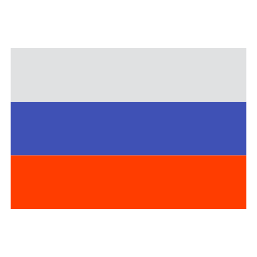

</img>

<table align="right">
 <tr><td><a href="README.md"> English</a></td></tr>
 <tr><th><a href="README_ru.md"> Русский</a></th></tr>
</table>

### :space_invader: &nbsp;Обо мне
&nbsp;&nbsp;&nbsp;:standing_person: &nbsp;Мне 26 лет. Backend разработчик из Узбекистана.\
&nbsp;&nbsp;&nbsp;:technologist: &nbsp;На данный момент работаю фрилансером на [Upwork](https://upwork.com/). \
&nbsp;&nbsp;&nbsp;:seedling: &nbsp;Люблю инновации и животных:dog:.\
&nbsp;&nbsp;&nbsp;:heartbeat: &nbsp;Увлекаюсь решением проблем и играми:video_game:.\
&nbsp;&nbsp;&nbsp;:writing_hand: &nbsp;Студент UoPeople.\
&nbsp;&nbsp;&nbsp;:hammer_and_wrench: &nbsp;Программирую с 2021 (Backend).\
&nbsp;&nbsp;&nbsp;:family_man_man_boy: &nbsp;Нахожусь в Узбекистане.
&nbsp;&nbsp;&nbsp;:page_facing_up: &nbsp;Резюме доступно на LinkedIn по ссылке ниже.

### :link: &nbsp;Как меня найти?

	&nbsp;&nbsp;&nbsp;&nbsp;
	&nbsp;&nbsp;&nbsp;&nbsp;
	&nbsp;&nbsp;&nbsp;&nbsp;
	&nbsp;&nbsp;&nbsp;&nbsp;
	&nbsp;&nbsp;&nbsp;&nbsp;

### :computer: &nbsp;Стек

  
<b>:man_technologist: &nbsp;Что я использую</b>

   
	
	
	
	
	
	
	
    
	
	
	
	 
	 
	
	
	
	
	 
	 
	
	
    
	
	
	
	
	
	
		
    
	
	 
	 
	
	
	
	
	
    
    
    
    
    
    
	
	 
	 
	
	
	
	
	
	
	
	
	
	
	 
	 
	 

  
<b>:brain: &nbsp;Что я изучаю</b>

   
	
	
	 
	 
	
	
    
	 
	 
    
	
    
    
    
    
    
    
	
	
	
	 
	 
    
	
    
	
    
    
	
	
	
	
	
	 
	 
    
	 
     
	 

### :keyboard: &nbsp;Проекты

	
<b>🎨 &nbsp;Frontend</b>

	 
		<ul style="list-style-type: none">
		<li>
			

				
<b>HTML/CSS</b>

				<blockquote>HTML+CSS Based projects (backend not included)</blockquote>
					<ul>
						<li><a href="https://github.com/ggwmwgg/cs50/tree/main/HCJs_Trivia" target="_blank">Trivia (HTML)</a></li>
						<li><a href="https://github.com/ggwmwgg/cs50web/tree/main/google" target="_blank">Google Search (CS50 Web)</a></li>
					</ul>
			

		</li>
		<li>
			

				
<b>JavaScript</b>

				<blockquote>JavaScript based projects</blockquote>
				<ul>
					<li><a href="https://github.com/ggwmwgg/jb/tree/main/Coffee_Machine_JS" target="_blank">Coffee Machine (Challenging)</a></li>
					<li><a href="https://github.com/ggwmwgg/jb/tree/main/Hangman_JS" target="_blank">Hangman (Hard)</a></li>
					<li><a href="https://github.com/ggwmwgg/jb/tree/main/Simple_Currency_Converter_JS" target="_blank">Simple Currency Converter (Medium)</a></li>
					<li><a href="https://github.com/ggwmwgg/jb/tree/main/Zookeeper_JS" target="_blank">Zookeeper (Easy)</a></li>
					<li><a href="https://github.com/ggwmwgg/cs50web/tree/main/mail" target="_blank">Mail (CS50 Web)</a></li>
				</ul>
			

		</li>
	</ul>

	
<b>🌐 &nbsp;Backend</b>

	 
	<ul style="list-style-type: none">
		<li>
			

				
<b>Flask</b>

				<blockquote>Flask based projects</blockquote>
					<ul>
						<li><a href="https://github.com/ggwmwgg/cs50/tree/main/CS50_Final" target="_blank">My Portfolio Website (CS50 Web)</a></li>
						<li><a href="https://github.com/ggwmwgg/cs50/tree/main/FLSK_Birthdays" target="_blank">Birthdays (CS50 Web)</a></li>
						<li><a href="https://github.com/ggwmwgg/cs50/tree/main/FLSK_Finance" target="_blank">Finance (CS50 Web)</a></li>
					</ul>
			

		</li>
		<li>
			

				
<b>Django</b>

				<blockquote>Django based projects</blockquote>
				<ul>
					<li><a href="https://github.com/ggwmwgg/cs50web/tree/main/wiki" target="_blank">Wiki (CS50 Web)</a></li>
					<li><a href="https://github.com/ggwmwgg/cs50web/tree/main/commerce" target="_blank">Commerce (CS50 Web)</a></li>
					<li><a href="https://github.com/ggwmwgg/cs50web/tree/main/mail" target="_blank">Mail (CS50 Web)</a></li>
					<li><a href="https://github.com/ggwmwgg/cs50web/tree/main/twitter" target="_blank">Twitter (CS50 Web)</a></li>
					<li><a href="https://github.com/ggwmwgg/cs50web/tree/main/cs50web_final" target="_blank">Final Project (CS50 Web)</a></li>
				</ul>
			

		</li>
		<li>
			

				
<b>Async</b>

				<blockquote>Python asynchronous projects</blockquote>
					<ul>
						<li><a href="https://github.com/ggwmwgg/tgbot" target="_blank">Telegram Bot Template</a></li>
						<li><a href="https://github.com/ggwmwgg/tgbot/tree/cafe_bot" target="_blank">Telegram for Cafe (example)</a></li>
					</ul>
			

		</li>
		<li>
			

				
<b>Other</b>

				<blockquote>Other backend projects</blockquote>
				<ul>
					<li><a href="https://github.com/ggwmwgg/jb/tree/main/Scraper_HS" target="_blank">Scraper</a></li>
				</ul>
			

		</li>
	</ul>

	
<b>🤖 &nbsp;Python (ML/AI (TO DO))</b>

	 
	<blockquote>Python ML/AI based projects</blockquote>
	<ul>
		<li><a href="https://github.com/ggwmwgg/" target="_blank">TO DO</a></li>
	</ul>

	
<b>🧪 &nbsp;Python (Pure)</b>

	 
	<blockquote>Проекты на чистом Python</blockquote>
	<ul>
		<li><a href="https://github.com/ggwmwgg/jb/tree/main/Arithmetic_HS" target="_blank">Arithmetic Exam Application</a></li>
		<li><a href="https://github.com/ggwmwgg/jb/tree/main/Calculator_HS" target="_blank">Smart Calculator</a></li>
		<li><a href="https://github.com/ggwmwgg/jb/tree/main/Easyrider_HS" target="_blank">Easy Rider Bus Company</a></li>
		<li><a href="https://github.com/ggwmwgg/jb/tree/main/Flashcards_HS" target="_blank">Flashcards</a></li>
		<li><a href="https://github.com/ggwmwgg/jb/tree/main/SCB_HS" target="_blank">Simple Chatty Bot</a></li>
		<li><a href="https://github.com/ggwmwgg/jb/tree/main/Zookeeper_HS" target="_blank">Zookeeper</a></li>
		<li><a href="https://github.com/ggwmwgg/cs50/tree/main/Py_Cash" target="_blank">Cash</a></li>
		<li><a href="https://github.com/ggwmwgg/cs50/tree/main/Py_DNA" target="_blank">DNA</a></li>
		<li><a href="https://github.com/ggwmwgg/cs50/tree/main/Py_Mario" target="_blank">Mario</a></li>
		<li><a href="https://github.com/ggwmwgg/cs50/tree/main/Py_Readability" target="_blank">Readability</a></li>
		<li><a href="https://github.com/ggwmwgg/jb/blob/main/TicTacToe_HS" target="_blank">TicTacToe</a></li>
	</ul>

	
<b>💾 &nbsp;Databases</b>

	 
	<blockquote>Database based projects</blockquote>
		<ul>
			<li><a href="https://github.com/ggwmwgg/jb/tree/main/Calculator_for_Investors_HS" target="_blank">Calculator for Investors</a></li>
			<li><a href="https://github.com/ggwmwgg/jb/tree/main/Food_Blog_Backend_HS" target="_blank">Food Blog Backend</a></li>
			<li><a href="https://github.com/ggwmwgg/jb/tree/main/SCB_HS" target="_blank">Simple Chatty Bot</a></li>
			<li><a href="https://github.com/ggwmwgg/jb/tree/main/Simple_Banking_System_HS" target="_blank">Simple Banking System</a></li>
			<li><a href="https://github.com/ggwmwgg/jb/tree/main/TO_DO_List_HS" target="_blank">TO DO List</a></li>
			<li><a href="https://github.com/ggwmwgg/cs50/tree/main/SQL_Movies" target="_blank">SQL Requests repo</a></li>
			<li><a href="https://github.com/ggwmwgg/cs50/tree/main/FLSK_Birthdays" target="_blank">Birthdays</a></li>
			<li><a href="https://github.com/ggwmwgg/cs50/tree/main/FLSK_Finance" target="_blank">Finance</a></li>
			<li><a href="https://github.com/ggwmwgg/tgbot/tree/cafe_bot" target="_blank">Telegram for Cafe (example)</a></li>
		</ul>

	
<b>🧠 &nbsp;Other</b>

	 
	<blockquote>Other projects</blockquote>
	<ul>
		<li><a href="#" target="_blank">Nothing here yet</a></li>
	</ul>

### :chart_with_upwards_trend: &nbsp;GitHub Статы

        

  
<b>:eight_spoked_asterisk: &nbsp;Other stats</b>

   
    

        
        
    

    </img>
<i>Особая благодарность <a href="https://github.com/brunotacca">@brunotacca</a> и <a href="https://github.com/Xx-Ashutosh-xX">@Xx-Ashutosh-xX</a> за идеи к этому README_ru.md</i>

